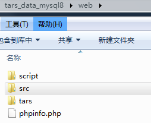
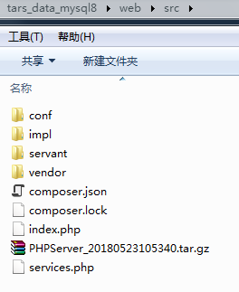
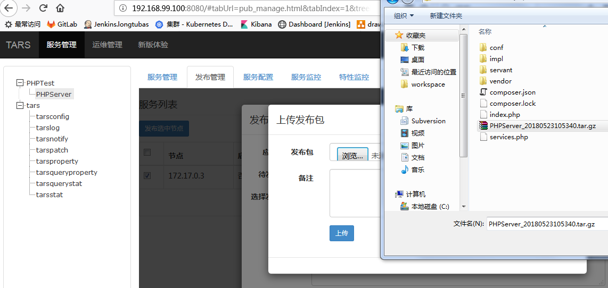
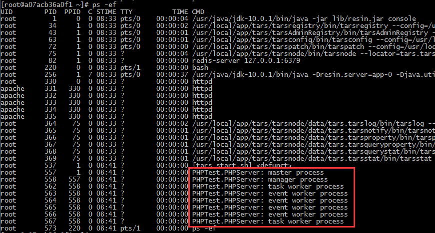

# Tencent Tars 的Docker镜像脚本与使用

## [Click to Read English Version](https://github.com/tangramor/docker-tars/docs/README_en.md)

* [MySQL](#mysql)
* [镜像](#镜像)
* [环境变量](#环境变量)
  * [DBIP, DBPort, DBUser, DBPassword](#dbip-dbport-dbuser-dbpassword)
  * [DBTarsPass](#dbtarspass)
  * [MOUNT_DATA](#mount_data)
  * [INET_NAME](#inet_name)
  * [MASTER](#master)
  * [框架普通基础服务](#框架普通基础服务)
* [自己构建镜像](#自己构建镜像)
* [开发方式](#开发方式)
  * [举例说明：](#举例说明)
* [Trouble Shooting](#trouble-shooting)
* [感谢](#感谢)

MySQL
-----

本镜像是Tars的docker版本，未安装mysql，可以使用官方mysql镜像（5.6）：
```
docker run --name mysql -e MYSQL_ROOT_PASSWORD=password -d -p 3306:3306 -v /c/Users/<ACCOUNT>/mysql_data:/var/lib/mysql mysql:5.6 --innodb_use_native_aio=0
```

注意上面的运行命令添加了 `--innodb_use_native_aio=0` ，因为mysql的aio对windows文件系统不支持


如果要使用 **5.7** 版本的mysql，需要再添加 `--sql_mode=NO_AUTO_CREATE_USER,NO_ENGINE_SUBSTITUTION` 参数，因为不支持全零的date字段值（ https://dev.mysql.com/doc/refman/5.7/en/sql-mode.html#sqlmode_no_zero_date ）
```
docker run --name mysql -e MYSQL_ROOT_PASSWORD=password -d -p 3306:3306 -v /c/Users/<ACCOUNT>/mysql_data:/var/lib/mysql mysql:5.7 --sql_mode=NO_AUTO_CREATE_USER,NO_ENGINE_SUBSTITUTION --innodb_use_native_aio=0
```


如果使用 **8.0** 版本的mysql，则直接设定 `--sql_mode=''`，即禁止掉缺省的严格模式，（参考 https://dev.mysql.com/doc/refman/8.0/en/sql-mode.html ）

```
docker run --name mysql -e MYSQL_ROOT_PASSWORD=password -d -p 3306:3306 -v /c/Users/<ACCOUNT>/mysql_data:/var/lib/mysql mysql:8 --sql_mode='' --innodb_use_native_aio=0
```

或者你也可以挂载使用一个自定义的 my.cnf 来添加上述参数。


镜像
----

docker镜像已经由docker hub自动构建：https://hub.docker.com/r/tangramor/docker-tars/ ，使用下面命令即可获取：
```
docker pull tangramor/docker-tars
```

tag 为 **php7** 的镜像包含了php7.2环境和phptars扩展，也添加了MySQL C++ connector以方便开发：
```
docker pull tangramor/docker-tars:php7
```

tag 为 **minideb** 的镜像是使用名为 minideb 的精简版 debian 作为基础镜像的版本：
```
docker pull tangramor/docker-tars:minideb
```

tag 为 **php7mysql8** 的镜像使用了 TARS 的 **[phptars](https://github.com/Tencent/Tars/tree/phptars)** 分支的代码，支持PHP服务端开发，包含php7.2、JDK 10以及mysql8相关的支持修改（对TARS配置做了修改）：
```
docker pull tangramor/docker-tars:php7mysql8
```

**tars-master** 之下是在镜像中删除了Tars源码的脚本，使用下面命令即可获取：
```
docker pull tangramor/tars-master
```

**tars-node** 之下是只部署 tarsnode 服务的节点镜像脚本，也删除了Tars源码，使用下面命令即可获取：
```
docker pull tangramor/tars-node
```


环境变量
--------
### DBIP, DBPort, DBUser, DBPassword

在运行容器时需要指定数据库的**环境变量**，例如：
```
DBIP mysql
DBPort 3306
DBUser root
DBPassword password
```


### DBTarsPass

因为Tars的源码里面直接设置了mysql数据库里tars用户的密码，所以为了安全起见，可以通过设定此**环境变量** `DBTarsPass` 来让安装脚本替换掉缺省的tars数据库用户密码。


### MOUNT_DATA

如果是在**Linux**或者**Mac**上运行，可以设定**环境变量** `MOUNT_DATA` 为 `true` 。此选项用于将Tars的系统进程的数据目录挂载到 /data 目录之下（一般把外部存储卷挂载为 /data 目录），这样即使重新创建容器，只要环境变量一致（数据库也没变化），那么之前的部署就不会丢失。这符合容器是无状态的原则。可惜在**Windows**下由于[文件系统与虚拟机共享文件夹的权限问题](https://discuss.elastic.co/t/filebeat-docker-running-on-windows-not-allowing-application-to-rotate-the-log/89616/11)，我们**不能**使用这个选项。


### INET_NAME
如果想要把docker内部服务直接暴露到宿主机，可以在运行docker时使用 `--net=host` 选项（docker缺省使用的是bridge桥接模式），这时我们需要确定宿主机的网卡名称，如果不是 `eth0`，那么需要设定**环境变量** `INET_NAME` 的值为宿主机网卡名称，例如 `--env INET_NAME=ens160`。这种方式启动docker容器后，可以在宿主机使用 `netstat -anop |grep '8080\|10000\|10001' |grep LISTEN` 来查看端口是否被成功监听。


### MASTER
节点服务器需要把自己注册到主节点master，这时候需要将tarsnode的配置修改为指向master节点IP或者hostname，此**环境变量** `MASTER` 用于 **tars-node** 镜像，在运行此镜像容器前需要确定master节点IP或主机名hostname。


run_docker_tars.sh 里的命令如下，请自己修改：
```
docker run -d -it --name tars --link mysql --env MOUNT_DATA=false --env DBIP=mysql --env DBPort=3306 --env DBUser=root --env DBPassword=PASS -p 8080:8080 -v /c/Users/<ACCOUNT>/tars_data:/data tangramor/docker-tars
```

### 框架普通基础服务
另外安装脚本把构建成功的 tarslog.tgz、tarsnotify.tgz、tarsproperty.tgz、tarsqueryproperty.tgz、tarsquerystat.tgz 和 tarsstat.tgz 都放到了 `/c/Users/<ACCOUNT>/tars_data/` 目录之下，可以参考Tars官方文档的 [安装框架普通基础服务](https://github.com/Tencent/Tars/blob/master/Install.md#44-%E5%AE%89%E8%A3%85%E6%A1%86%E6%9E%B6%E6%99%AE%E9%80%9A%E5%9F%BA%E7%A1%80%E6%9C%8D%E5%8A%A1) 来安装这些服务。


自己构建镜像 
-------------

镜像构建命令：`docker build -t tars .`

tars-master 镜像构建命令：`docker build -t tars-master -f tars-master/Dockerfile .`

tars-node 镜像构建命令：`docker build -t tars-node -f tars-node/Dockerfile .`


开发方式
--------
使用docker镜像进行Tars相关的开发就方便很多了，我的做法是把项目放置在被挂载到镜像 /data 目录的本地目录下，例如 `/c/Users/<ACCOUNT>/tars_data` 。在本地使用编辑器或IDE对项目文件进行开发，然后开启命令行：`docker exec -it tars bash` 进入Tars环境进行编译或测试。

### 举例说明：
    
1. **开发C++服务端**

  首先使用docker命令启动容器，这里我们可以用 `tangramor/tars-master`  或者 `tangramor/docker-tars`：
  ```
  docker run -d -it --name tars -p 8080:8080 -v /c/Users/tangramor/Workspace/tars_data:/data tangramor/tars-master
  ```
  这个命令启动了 `tangramor/tars-master` 容器 **tars** 并将本地的一个目录 `/c/Users/tangramor/Workspace/tars_data` 挂载为容器的 /data 目录，同时它还把 8080 端口暴露出来了。
  
  然后我们可以在宿主机的 `/c/Users/tangramor/Workspace/tars_data` 目录下看到有两个子目录被创建出来了：log、tars，前者是resin的日志目录，后者里面是Tars各系统进程的日志目录。同时 `/c/Users/tangramor/Workspace/tars_data` 目录下还有各个需要手动部署的 Tars 子系统的部署 tgz 包，我们参考 [安装框架普通基础服务](https://github.com/Tencent/Tars/blob/master/Install.md#44-%E5%AE%89%E8%A3%85%E6%A1%86%E6%9E%B6%E6%99%AE%E9%80%9A%E5%9F%BA%E7%A1%80%E6%9C%8D%E5%8A%A1) 来安装这些服务。
  
  运行 `docker exec -it tars bash` 进入容器 **tars**，`cd /data` 进入工作目录，参考官方的 [服务开发](https://github.com/Tencent/Tars/blob/master/docs/tars_cpp_quickstart.md#5-%E6%9C%8D%E5%8A%A1%E5%BC%80%E5%8F%91--) 文档，开发 TestApp.HelloServer，其中 testHello 方法修改如下：
  
  ```
  int HelloImp::testHello(const std::string &sReq, std::string &sRsp, tars::TarsCurrentPtr current)
  {
      TLOGDEBUG("HelloImp::testHellosReq:"<<sReq<<endl);
      sRsp = sReq + " World!";
      return 0;
  }
  
  ```
  
  然后将编译完成的 HelloServer.tgz 部署到 tars-master 容器或者 docker-tars 容器里

2. **开发 C++服务端 的 PHP客户端**

  C++的客户端可以参考官方的 [客户端同步/异步调用服务](https://github.com/Tencent/Tars/blob/master/docs/tars_cpp_quickstart.md#54-%E5%AE%A2%E6%88%B7%E7%AB%AF%E5%90%8C%E6%AD%A5%E5%BC%82%E6%AD%A5%E8%B0%83%E7%94%A8%E6%9C%8D%E5%8A%A1)。注意如果要把C++的客户端部署到 tars-node 容器里，那么不要混用 minideb 标签和 latest、php7 标签的镜像，因为会有依赖问题。
  
  这里主要讲一下PHP的客户端开发与部署。
  
  首先使用docker命令启动**php7**标签的容器，这里我们可以用 `tangramor/tars-node:php7` ：
  
  ```
  docker run -d -it --name tars-node --link tars:tars -p 80:80 -v /c/Users/tangramor/Workspace/tars_node:/data tangramor/tars-node:php7
  ```
  
  这个命令启动了 `tangramor/tars-node:php7` 容器 **tars-node** 并将本地的一个目录 `/c/Users/tangramor/Workspace/tars_node` 挂载为容器的 /data 目录，同时它连接了命名为 **tars** 的服务端容器，还把 80 端口暴露出来了。
  
  我们可以在宿主机的 `/c/Users/tangramor/Workspace/tars_node` 目录下看到有三个子目录被创建出来了：log、tars 和 web。前两个都是日志目录，最后一个在容器中被链接为 `/var/www/html`，也就是Apache服务器的根目录。并且在 web 目录下可以看到 phpinfo.php 文件。我们使用浏览器访问 http://127.0.0.1/phpinfo.php （linux、mac）或 http://192.168.99.100/phpinfo.php （windows）就可以看到PHP的信息页面了。
  
  我们从宿主机的 `/c/Users/tangramor/Workspace/tars_data/TestApp/HelloServer` 目录里找到 `Hello.tars` 文件，将它拷贝到宿主机的 `/c/Users/tangramor/Workspace/tars_node/web` 目录下。
  
  运行 `docker exec -it tars-node bash` 进入容器 **tars-node**，`cd /data/web` 来到web目录，然后执行 `wget https://raw.githubusercontent.com/Tencent/Tars/master/php/tarsclient/tars2php.php` 把 `tars2php.php` 文件下载到本地。然后执行 `php tars2php.php Hello.tars "TestApp.HelloServer.HelloObj"` ，我们可以在 web 目录下看到 TestApp 目录被创建出来，`TestApp/HelloServer/HelloObj` 目录下是生成的PHP的客户端文件。
  
  在 web 目录下再创建一个 `composer.json` 文件，内容如下：
  
  ```
  {
    "name": "demo",
    "description": "demo",
    "authors": [
      {
        "name": "Tangramor",
        "email": "tangramor@qq.com"
      }
    ],
    "require": {
      "php": ">=5.3",
      "phptars/tars-assistant" : "0.2.1"
    },
    "autoload": {
      "psr-4": {
        "TestApp\\": "TestApp/"
      }
    }
  }
  ```
  
  然后运行 `composer install` 命令，`vendor` 目录被创建出来了。这表明我们可以在PHP文件里使用 autoload 来加载 phptars。在 web 目录下新建 `index.php` 文件，内容如下：
  
  ```
  <?php
      require_once("./vendor/autoload.php");
      // 指定主控
      $host = "tars";
      $port = 20001;
  
      $start = microtime();
  
      try {
          $servant = new TestApp\HelloServer\HelloObj\Hello($host, $port);
  
          $in1 = "Hello";
  
          $intVal = $servant->testHello($in1,$out1);
  
          echo "服务器返回：".$out1;
  
      } catch(phptars\TarsException $e) {
          // 错误处理
          echo "Error: ".$e;
      }
  
      $end = microtime();
  
      echo "<p>耗时：".($end - $start)." 秒</p>";
  ```
  
  在宿主机上使用浏览器访问 http://127.0.0.1/index.php （linux、mac）或 http://192.168.99.100/index.php （windows），如果没有意外，页面应该返回类似下面的内容：
  
  ```
  服务器返回：Hello World!
  
  耗时：0.051169 秒
  ```

3. **开发PHP服务端**

  我们使用标签为 `php7mysql8` 的 `tangramor/docker-tars` 镜像来进行PHP服务端的开发（假设你用的是Windows）： 
  
  ```
  docker run --name mysql8 -e MYSQL_ROOT_PASSWORD=password -d -p 3306:3306 -v /c/Users/tangramor/mysql8_data:/var/lib/mysql mysql:8 --sql_mode="" --innodb_use_native_aio=0
  
  docker run -d -it --name tars_mysql8 --link mysql8 --env DBIP=mysql8 --env DBPort=3306 --env DBUser=root --env DBPassword=password -p 8080:8080 -p 80:80 -v /c/Users/tangramor/tars_mysql8_data:/data tangramor/docker-tars:php7mysql8
  ```
  
  这两个命令分别启动了mysql容器（8.0版）和  `tangramor/docker-tars:php7mysql8` 容器 **tars_mysql8**，并将本地的一个目录 `/c/Users/tangramor/Workspace/tars_mysql8_data` 挂载为容器的 /data 目录，同时它还把 8080 和 80 端口暴露出来了。
  
  我们进入 `/c/Users/tangramor/Workspace/tars_mysql8_data/web` 目录，在其下创建对应的目录结构： `scripts`、`src` 和 `tars`，
  
  
  
  运行 `docker exec -it tars_mysql8 bash` 进入容器 **tars_mysql8**，`cd /data/web` 进入工作目录。
  
  在 `tars` 目录下创建一个 `test.tars` 文件（参考[phptars分支例子](https://github.com/Tencent/Tars/blob/phptars/php/examples/tars-tcp-server/tars/example.tars)）：
  
  ```
  module testtafserviceservant
  {
      struct SimpleStruct {
          0 require long id=0;
          1 require int count=0;
          2 require short page=0;
      };
  
      struct OutStruct {
          0 require long id=0;
          1 require int count=0;
          2 require short page=0;
          3 optional string str;
      };
  
      struct ComplicatedStruct {
          0 require vector<SimpleStruct> ss;
          1 require SimpleStruct rs;
          2 require map<string, SimpleStruct> mss;
          3 optional string str;
      }
  
      struct LotofTags {
          0 require long id=0;
          1 require int count=0;
          2 require short page=0;
          3 optional string str;
          4 require vector<SimpleStruct> ss;
          5 require SimpleStruct rs;
          6 require map<string, SimpleStruct> mss;
      }
  
      interface TestTafService
      {
  
          void testTafServer();
  
          int testLofofTags(LotofTags tags, out LotofTags outtags);
  
          void sayHelloWorld(string name, out string outGreetings);
  
          int testBasic(bool a, int b, string c, out bool d, out int e, out string f);
  
          string testStruct(long a, SimpleStruct b, out OutStruct d);
  
          string testMap(short a, SimpleStruct b, map<string, string> m1, out OutStruct d, out map<int, SimpleStruct> m2);
  
          string testVector(int a, vector<string> v1, vector<SimpleStruct> v2, out vector<int> v3, out vector<OutStruct> v4);
  
          SimpleStruct testReturn();
  
          map<string,string> testReturn2();
  
          vector<SimpleStruct> testComplicatedStruct(ComplicatedStruct cs,vector<ComplicatedStruct> vcs, out ComplicatedStruct ocs,out vector<ComplicatedStruct> ovcs);
  
          map<string,ComplicatedStruct> testComplicatedMap(map<string,ComplicatedStruct> mcs, out map<string,ComplicatedStruct> omcs);
  
          int testEmpty(short a,out bool b1, out int in2, out OutStruct d, out vector<OutStruct> v3,out vector<int> v4);
  
          int testSelf();
  
          int testProperty();
  
      };
  
  }
  ```
  
  然后再在 `tars` 目录下创建一个 `tars.proto.php` 文件：
  
  ```
  <?php
  
    return array(
        'appName' => 'PHPTest', //tars服务servant name 的第一部分
        'serverName' => 'PHPServer', //tars服务servant name 的第二部分
        'objName' => 'obj', //tars服务servant name 的第三部分
        'withServant' => true,//决定是服务端,还是客户端的自动生成
        'tarsFiles' => array(
            './test.tars' //tars文件的地址
        ),
        'dstPath' => '../src/servant', //生成php文件的位置
        'namespacePrefix' => 'Server\servant', //生成php文件的命名空间前缀
    );
  ```
  
  在 `scripts` 目录下创建 `tars2php.sh`，并赋予执行权限 `chmod u+x tars2php.sh`：
  ```
  cd ../tars/
  
  php /root/phptars/tars2php.php ./tars.proto.php
  ```
  
  创建目录 `src/servant`，然后执行 `./scripts/tars2php.sh`，可以看到 `src/servant` 目录下面生成一个三级文件夹 `PHPTest/PHPServer/obj`，包含：
  
  * classes文件夹 - 存放tars中的struct生成的文件
  * tars文件夹 - 存放tars文件
  * TestTafServiceServant.php - interface文件
  
  
  
  进入 `src` 目录，我们开始服务端代码的实现。因为使用的是官方例子，所以这里直接将例子的实现代码拷贝过来：
  
  ```
  wget https://github.com/Tencent/Tars/raw/phptars/php/examples/tars-tcp-server/src/composer.json
  wget https://github.com/Tencent/Tars/raw/phptars/php/examples/tars-tcp-server/src/index.php
  wget https://github.com/Tencent/Tars/raw/phptars/php/examples/tars-tcp-server/src/services.php
  mkdir impl && cd impl && wget https://github.com/Tencent/Tars/raw/phptars/php/examples/tars-tcp-server/src/impl/PHPServerServantImpl.php && cd ..
  mkdir conf && cd conf && wget https://github.com/Tencent/Tars/raw/phptars/php/examples/tars-tcp-server/src/conf/ENVConf.php && cd ..
  ```
  
  - conf: 业务需要的配置，这里只是给出一个demo，如果从平台下发配置，默认也会写入到这个文件夹中；
  - impl: 业务实际的实现代码，是对interface的对应实现，具体实现的文件路径需要写入到services.php中；
  - composer.json: 项目的依赖；
  - index.php: 整个服务的入口文件。可以自定义，但是必须要更改平台上的私有模板，在server下面增加entrance这个字段；
  - services.php: 声明interface的地址，声明实际实现的地址，这个两个地址会被分别用作实例化调用和注解解析。
  
  修改一下 `conf/ENVConf.php` 的配置信息。在 `src` 目录下运行 `composer install` 加载对应的依赖包，然后执行 `composer run-script deploy` 进行代码打包，一个名字类似 `PHPServer_20180523105340.tar.gz` 的包就打好了。
  
  
  
  在 `/data` 目录下创建一个 `logs` 目录，因为这个例子会在这下面写文件。
  
  将打好的包发布到Tars平台，记得选择php方式，模版使用 `tars.tarsphp.default` 或者自己根据需求新建一个模版：
  
  
  
  
  
  发布成功后，在系统里执行 `ps -ef` 会发现相关的进程。
  
  


4. **开发PHP客户端**

  我们在同一个容器里进行上面服务端的客户端开发和测试，当然你也可以自己创建一个新的容器来尝试。
  
  我们进入 `/c/Users/tangramor/Workspace/tars_mysql8_data/web` 目录，在其下创建对应的目录 `client`。
  
  运行 `docker exec -it tars_mysql8 bash` 进入容器 **tars_mysql8**，`cd /data/web/client` 进入工作目录。
  
  将 3. **开发PHP服务端** 里创建的test.tars文件拷贝到当前目录，然后创建一个文件 `tarsclient.proto.php`：
  
  ```
  <?php
  
    return array(
        'appName' => 'PHPTest',
        'serverName' => 'PHPServer',
        'objName' => 'obj',
        'withServant' => false,//决定是服务端,还是客户端的自动生成
        'tarsFiles' => array(
            './test.tars'
        ),
        'dstPath' => './',
        'namespacePrefix' => 'Client\servant',
    );
  ```
  
  运行 `php /root/phptars/tars2php.php ./tarsclient.proto.php` ，可以看到在当前目录下生成了一个三级文件夹 `PHPTest/PHPServer/obj`，包含：
  
  * classes文件夹 - 存放tars中的struct生成的文件
  * tars文件夹 - 存放tars文件
  * TestTafServiceServant.php - 客户端类 TestTafServiceServant 文件
  
  在当前目录创建一个 `composer.json` 文件：
  
  ```
  {
    "name": "demo",
    "description": "demo",
    "authors": [
      {
        "name": "Tangramor",
        "email": "tangramor@qq.com"
      }
    ],
    "require": {
      "php": ">=5.3",
      "phptars/tars-client" : "0.1.0"
    },
    "autoload": {
      "psr-4": {
        "Client\\servant\\": "./"
      }
    },
    "repositories": {
      "tars": {
        "type": "composer",
        "url": "https://raw.githubusercontent.com/Tencent/Tars/phptars/php/dist/tarsphp.json"
      }
    }
  }
  
  ```
  
  然后再创建一个 `index.php` 文件：
  ```
  <?php
    require_once("./vendor/autoload.php");
  
    // 指定主控ip、port
    $config = new \Tars\client\CommunicatorConfig();
    $config->setLocator('tars.tarsregistry.QueryObj@tcp -h 172.17.0.3 -p 17890');
    $config->setModuleName('PHPTest.PHPServer');
    $config->setCharsetName('UTF-8');
  
    $servant = new Client\servant\PHPTest\PHPServer\obj\TestTafServiceServant($config);
  
    $name = 'ted';
    $intVal = $servant->sayHelloWorld($name, $greetings);
  
    echo '<p>'.$greetings.'</p>';
  ```
  
  执行 `composer install` 命令加载对应的依赖包，然后运行 `php index.php` 来测试客户端，如果一切顺利，应该输出：`<p>hello world!</p>` 。我们使用浏览器来访问 http://192.168.99.100/client/index.php ，应该也能看到：
  
  
  
  在 `/data/logs` 目录下查看 `ted.log`，应该有内容写入：`sayHelloWorld name:ted` 。


Trouble Shooting
----------------

在启动容器后，可以 `docker exec -it tars bash` 进入容器，查看当前运行状态；如果 `/c/Users/<ACCOUNT>/tars_data/log/tars` 下面出现了 _log4j.log 文件，说明安装已经完成，resin运行起来了。


感谢
------

本镜像脚本根据 https://github.com/panjen/docker-tars 修改，最初版本来自 https://github.com/luocheng812/docker_tars 。


